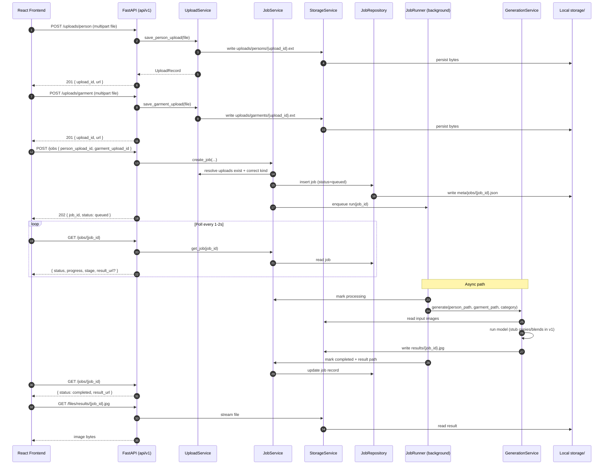
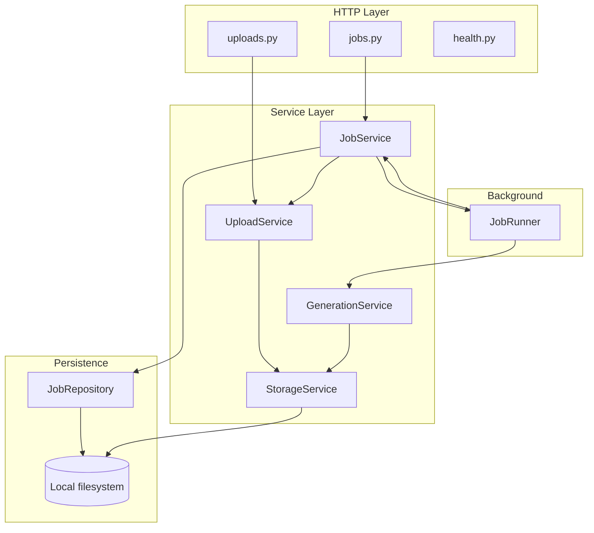
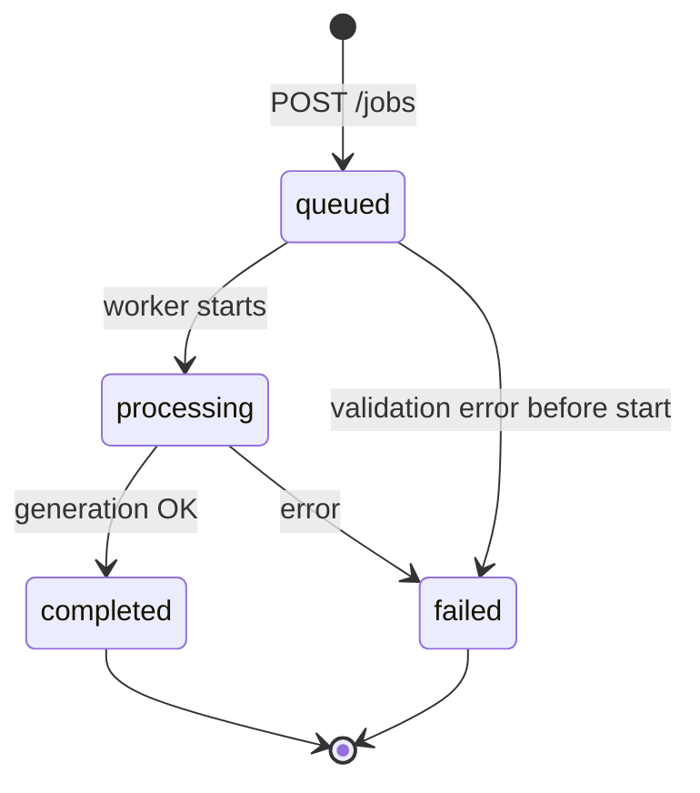

# FitCheck AI — Backend Architecture

**Stack:** Python 3.11+, FastAPI  
**Storage (v1):** Local filesystem under `backend/storage/`  
**Scope:** Upload person/garment images, create generation jobs, poll status, serve result images.  
**Status:** Design only — no implementation in this document.

This document aligns with the TanStack Start frontend routes (`/try-on` → `/processing` → `/results`) and replaces mock data with a real job lifecycle.

---

## 1. Folder Structure

```
backend/
├── BACKEND_ARCHITECTURE.md      # This document
├── README.md                    # Setup, run, env vars (to be added)
├── requirements.txt             # Pinned dependencies (FastAPI, uvicorn, etc.)
├── .env.example                 # Documented environment variables
├── .gitignore                   # Ignore storage/, .env, __pycache__
│
├── app/
│   ├── __init__.py
│   ├── main.py                  # FastAPI app factory, lifespan, router mount
│   ├── config.py                # Settings (pydantic-settings): paths, limits, CORS
│   │
│   ├── api/
│   │   ├── __init__.py
│   │   ├── deps.py              # Shared dependencies (settings, services)
│   │   └── v1/
│   │       ├── __init__.py
│   │       ├── router.py        # Aggregates v1 routes
│   │       ├── uploads.py       # POST upload endpoints (person, garment)
│   │       ├── jobs.py          # POST create job, GET status, GET result
│   │       └── health.py        # GET /health, GET /ready
│   │
│   ├── schemas/
│   │   ├── __init__.py
│   │   ├── upload.py            # Upload response models
│   │   ├── job.py               # Job create, status, result models
│   │   └── common.py            # Error body, pagination (future)
│   │
│   ├── services/
│   │   ├── __init__.py
│   │   ├── upload_service.py    # Validate, save, resolve upload paths
│   │   ├── job_service.py     # Create job, transition status, attach uploads
│   │   ├── generation_service.py # Orchestrate AI step (stub → real model later)
│   │   └── storage_service.py   # Local FS read/write/delete, URL path helpers
│   │
│   ├── repositories/
│   │   ├── __init__.py
│   │   └── job_repository.py    # Persist job records (JSON/SQLite in v1)
│   │
│   ├── models/
│   │   ├── __init__.py
│   │   └── job.py               # Domain enums + dataclasses (JobStatus, Job)
│   │
│   ├── workers/
│   │   ├── __init__.py
│   │   └── job_runner.py        # Background task: run generation, update job
│   │
│   └── core/
│       ├── __init__.py
│       ├── exceptions.py        # AppError hierarchy → HTTP mapping
│       └── logging.py           # Structured logging setup
│
├── storage/                     # Runtime data (gitignored)
│   ├── uploads/
│   │   ├── persons/             # Original person images
│   │   └── garments/            # Original garment images
│   ├── results/                 # Generated try-on outputs
│   └── meta/
│       └── jobs/                # Job JSON sidecars (v1 persistence)
│
└── tests/
    ├── __init__.py
    ├── conftest.py              # Test client, temp storage fixture
    ├── api/
    │   ├── test_uploads.py
    │   └── test_jobs.py
    └── services/
        └── test_job_service.py
```

### Layering rules

| Layer | May import | Must not |
|-------|------------|----------|
| `api/` | `schemas`, `services`, `deps`, `core` | `repositories` directly (go through services) |
| `services/` | `models`, `repositories`, `core` | FastAPI types |
| `repositories/` | `models`, filesystem / DB | HTTP concerns |
| `schemas/` | `models` (optional) | Business logic |
| `workers/` | `services`, `repositories` | Route handlers |

---

## 2. API Contract

**Base URL:** `http://localhost:8000` (dev)  
**API prefix:** `/api/v1`  
**Content types:** `multipart/form-data` for uploads; `application/json` for job APIs  
**Identifiers:** UUID v4 strings for `upload_id` and `job_id`

### 2.1 Conventions

- All successful JSON responses use the shapes below unless noted.
- Errors use a consistent envelope:

```json
{
  "error": {
    "code": "VALIDATION_ERROR",
    "message": "Human-readable summary",
    "details": {}
  }
}
```

| HTTP | When |
|------|------|
| `400` | Invalid input, unsupported file type |
| `404` | Unknown `upload_id` or `job_id` |
| `409` | Job not in state required for operation |
| `413` | File too large |
| `422` | FastAPI validation (field-level `detail` array) |
| `500` | Unhandled server error |

- **Static files:** Result and upload preview URLs are served under `/files/...` (see §4). Clients use absolute URLs returned in JSON.
- **CORS:** Allow frontend origin from env (`CORS_ORIGINS`).

---

### 2.2 Health

#### `GET /api/v1/health`

Liveness check.

**Response `200`**

```json
{
  "status": "ok",
  "service": "fitcheck-api",
  "version": "0.1.0"
}
```

#### `GET /api/v1/ready`

Readiness (storage writable, job store reachable).

**Response `200`**

```json
{
  "status": "ready",
  "checks": {
    "storage": "ok",
    "job_store": "ok"
  }
}
```

**Response `503`** if any check fails.

---

### 2.3 Uploads

#### `POST /api/v1/uploads/person`

Upload a user/person image.

**Request:** `multipart/form-data`

| Field | Type | Required | Rules |
|-------|------|----------|-------|
| `file` | file | yes | `image/jpeg`, `image/png`, `image/webp`; max 10 MB |

**Response `201`**

```json
{
  "upload_id": "550e8400-e29b-41d4-a716-446655440000",
  "kind": "person",
  "original_filename": "selfie.jpg",
  "content_type": "image/jpeg",
  "size_bytes": 2457600,
  "url": "http://localhost:8000/files/uploads/persons/550e8400-e29b-41d4-a716-446655440000.jpg",
  "created_at": "2026-06-01T12:00:00Z"
}
```

---

#### `POST /api/v1/uploads/garment`

Upload a garment/clothing image.

**Request:** Same as person upload.

**Response `201`**

```json
{
  "upload_id": "660e8400-e29b-41d4-a716-446655440001",
  "kind": "garment",
  "original_filename": "shirt.png",
  "content_type": "image/png",
  "size_bytes": 512000,
  "url": "http://localhost:8000/files/uploads/garments/660e8400-e29b-41d4-a716-446655440001.png",
  "created_at": "2026-06-01T12:00:01Z"
}
```

---

#### `GET /api/v1/uploads/{upload_id}` *(optional v1)*

Metadata for an existing upload.

**Response `200`:** Same fields as upload response (without re-upload).

**Response `404`:** Upload not found or expired (if TTL added later).

---

### 2.4 Generation jobs

#### `POST /api/v1/jobs`

Create a try-on generation job from two prior uploads.

**Request:** `application/json`

```json
{
  "person_upload_id": "550e8400-e29b-41d4-a716-446655440000",
  "garment_upload_id": "660e8400-e29b-41d4-a716-446655440001",
  "garment_category": "T-Shirt",
  "metadata": {
    "source": "web",
    "product_url": null
  }
}
```

| Field | Type | Required | Notes |
|-------|------|----------|-------|
| `person_upload_id` | string (uuid) | yes | From `POST .../uploads/person` |
| `garment_upload_id` | string (uuid) | yes | From `POST .../uploads/garment` |
| `garment_category` | string | no | e.g. `T-Shirt`, `Blazer`; default `"T-Shirt"` |
| `metadata` | object | no | Opaque client context; stored on job |

**Response `202 Accepted`**

Job is queued; client should poll status.

```json
{
  "job_id": "770e8400-e29b-41d4-a716-446655440002",
  "status": "queued",
  "progress": 0,
  "person_upload_id": "550e8400-e29b-41d4-a716-446655440000",
  "garment_upload_id": "660e8400-e29b-41d4-a716-446655440001",
  "garment_category": "T-Shirt",
  "created_at": "2026-06-01T12:00:05Z",
  "updated_at": "2026-06-01T12:00:05Z",
  "status_url": "/api/v1/jobs/770e8400-e29b-41d4-a716-446655440002",
  "result_url": null
}
```

**Response `400`:** Missing or invalid upload IDs, wrong upload `kind`, upload file missing on disk.

---

#### `GET /api/v1/jobs/{job_id}`

Poll generation status.

**Response `200`**

```json
{
  "job_id": "770e8400-e29b-41d4-a716-446655440002",
  "status": "processing",
  "progress": 45,
  "stage": "Matching clothing texture",
  "person_upload_id": "550e8400-e29b-41d4-a716-446655440000",
  "garment_upload_id": "660e8400-e29b-41d4-a716-446655440001",
  "garment_category": "T-Shirt",
  "created_at": "2026-06-01T12:00:05Z",
  "updated_at": "2026-06-01T12:00:12Z",
  "started_at": "2026-06-01T12:00:06Z",
  "completed_at": null,
  "error": null,
  "result_url": null
}
```

When `status` is `completed`:

```json
{
  "job_id": "770e8400-e29b-41d4-a716-446655440002",
  "status": "completed",
  "progress": 100,
  "stage": null,
  "completed_at": "2026-06-01T12:00:28Z",
  "result_url": "http://localhost:8000/files/results/770e8400-e29b-41d4-a716-446655440002.jpg",
  "error": null
}
```

When `status` is `failed`:

```json
{
  "job_id": "770e8400-e29b-41d4-a716-446655440002",
  "status": "failed",
  "progress": 0,
  "error": {
    "code": "GENERATION_FAILED",
    "message": "Model inference failed"
  },
  "result_url": null
}
```

**Job status enum**

| `status` | Meaning |
|----------|---------|
| `queued` | Accepted, not started |
| `processing` | Worker running |
| `completed` | Result file available |
| `failed` | Terminal error |
| `cancelled` | *(reserved)* User/system cancelled |

**Polling guidance for frontend**

- Poll every **1–2 s** while `queued` or `processing`.
- Stop when `status` is `completed` or `failed`.
- Use `progress` (0–100) and `stage` (string) for UI matching `/processing`.

---

#### `GET /api/v1/jobs/{job_id}/result`

Return result metadata and image URL. Convenience endpoint; overlaps with completed `GET /jobs/{id}`.

**Response `200`** (only when `status === completed`)

```json
{
  "job_id": "770e8400-e29b-41d4-a716-446655440002",
  "result_url": "http://localhost:8000/files/results/770e8400-e29b-41d4-a716-446655440002.jpg",
  "content_type": "image/jpeg",
  "size_bytes": 1894400,
  "width": 1024,
  "height": 1024,
  "completed_at": "2026-06-01T12:00:28Z"
}
```

**Response `409`:** Job not completed yet.

**Response `404`:** Unknown job.

---

#### `GET /api/v1/jobs` *(optional v1)*

List recent jobs (newest first). For `/history` page later.

**Query**

| Param | Default | Notes |
|-------|---------|-------|
| `limit` | `20` | Max 100 |
| `offset` | `0` | Pagination |

**Response `200`**

```json
{
  "items": [
    {
      "job_id": "770e8400-e29b-41d4-a716-446655440002",
      "status": "completed",
      "garment_category": "T-Shirt",
      "result_url": "http://localhost:8000/files/results/770e8400-e29b-41d4-a716-446655440002.jpg",
      "created_at": "2026-06-01T12:00:05Z",
      "completed_at": "2026-06-01T12:00:28Z"
    }
  ],
  "total": 1,
  "limit": 20,
  "offset": 0
}
```

---

### 2.5 Static file serving

#### `GET /files/uploads/persons/{filename}`

#### `GET /files/uploads/garments/{filename}`

#### `GET /files/results/{filename}`

Serve stored binaries. `filename` is `{upload_id}.{ext}` or `{job_id}.{ext}` per §4.

- **Response `200`:** Image bytes with correct `Content-Type`.
- **Response `404`:** File missing.

In production, replace with signed CDN URLs; keep the same path convention in JSON responses.

---

### 2.6 Frontend mapping

| Frontend route | Backend calls |
|----------------|---------------|
| `/try-on` | `POST /uploads/person`, `POST /uploads/garment`, then `POST /jobs` |
| `/processing` | `GET /jobs/{job_id}` (poll) |
| `/results` | `GET /jobs/{job_id}/result` or use `result_url` from status |
| `/history` | `GET /jobs` (optional v1) |

**Recommended client flow:** After `POST /jobs`, navigate to `/processing?jobId={job_id}` and pass `job_id` to the poller.

---

## 3. Data Flow Diagram

### 3.1 End-to-end try-on flow



### 3.2 Component flow (logical)



### 3.3 Job state machine



---

## 4. File Naming Conventions

### 4.1 Upload files

| Kind | Directory | Filename pattern | Example |
|------|-----------|------------------|---------|
| Person | `storage/uploads/persons/` | `{upload_id}.{ext}` | `550e8400-e29b-41d4-a716-446655440000.jpg` |
| Garment | `storage/uploads/garments/` | `{upload_id}.{ext}` | `660e8400-e29b-41d4-a716-446655440001.png` |

**Rules**

- `upload_id` = UUID v4, lowercase, hyphenated.
- `ext` derived from validated content type: `jpeg` → `.jpg`, `png` → `.png`, `webp` → `.webp`.
- Original client filename is **not** used on disk (avoid path traversal and collisions).
- One file per `upload_id`; re-upload with same ID is not allowed (new ID per request).

### 4.2 Result files

| Directory | Filename pattern | Example |
|-----------|------------------|---------|
| `storage/results/` | `{job_id}.{ext}` | `770e8400-e29b-41d4-a716-446655440002.jpg` |

**Rules**

- `job_id` = UUID v4 matching the job record.
- Default output format v1: `.jpg` (`image/jpeg`) unless config says otherwise.
- Only written when generation succeeds; failed jobs leave no result file (or write nothing).

### 4.3 Job metadata (v1 persistence)

| Directory | Filename pattern | Contents |
|-----------|------------------|----------|
| `storage/meta/jobs/` | `{job_id}.json` | Full job record (status, paths, timestamps, error) |

**Example job sidecar fields (reference)**

```json
{
  "job_id": "770e8400-e29b-41d4-a716-446655440002",
  "status": "processing",
  "progress": 45,
  "stage": "Matching clothing texture",
  "person_upload_id": "550e8400-e29b-41d4-a716-446655440000",
  "garment_upload_id": "660e8400-e29b-41d4-a716-446655440001",
  "person_path": "uploads/persons/550e8400-e29b-41d4-a716-446655440000.jpg",
  "garment_path": "uploads/garments/660e8400-e29b-41d4-a716-446655440001.png",
  "result_path": null,
  "garment_category": "T-Shirt",
  "metadata": {},
  "error": null,
  "created_at": "2026-06-01T12:00:05Z",
  "updated_at": "2026-06-01T12:00:12Z",
  "started_at": "2026-06-01T12:00:06Z",
  "completed_at": null
}
```

### 4.4 Public URL mapping

| Filesystem path (under `storage/`) | Public URL |
|-----------------------------------|------------|
| `uploads/persons/{upload_id}.ext` | `/files/uploads/persons/{upload_id}.ext` |
| `uploads/garments/{upload_id}.ext` | `/files/uploads/garments/{upload_id}.ext` |
| `results/{job_id}.ext` | `/files/results/{job_id}.ext` |

Base URL prefix comes from config (`PUBLIC_BASE_URL`) when building absolute URLs in JSON.

### 4.5 Upload registry (optional v1)

Small JSON index per upload at `storage/meta/uploads/{upload_id}.json` for fast lookup and metadata without scanning directories. If omitted, infer from filesystem + job references only.

---

## 5. Service Responsibilities

### 5.1 `StorageService`

**Owns:** All local filesystem I/O under `storage/`.

| Responsibility | Details |
|----------------|---------|
| Write upload | Atomic write to temp then rename into `uploads/{kind}/` |
| Write result | Save generation output to `results/` |
| Read / stream | Open file for static handler or internal processing |
| Path resolution | Map `upload_id` / `job_id` → absolute path |
| URL building | Combine `PUBLIC_BASE_URL` + `/files/...` |
| Existence checks | `exists(upload_id)`, `exists_result(job_id)` |
| Cleanup *(future)* | TTL deletion of uploads/results |

**Does not:** Validate image content (delegated to UploadService), run AI, manage job status.

---

### 5.2 `UploadService`

**Owns:** Ingestion and validation of person/garment images.

| Responsibility | Details |
|----------------|---------|
| Validate MIME | Allowlist: JPEG, PNG, WebP |
| Validate size | Enforce `MAX_UPLOAD_BYTES` from config |
| Validate dimensions *(optional v1)* | Min/max width/height via Pillow |
| Generate `upload_id` | UUID v4 |
| Persist | Call `StorageService` with correct kind folder |
| Record metadata | Return `UploadRecord` (id, url, size, timestamps) |
| Lookup | `get_upload(upload_id)` for job creation |

**Does not:** Create jobs, run generation, expose HTTP.

---

### 5.3 `JobService`

**Owns:** Job lifecycle and API-facing job operations.

| Responsibility | Details |
|----------------|---------|
| Create job | Verify both uploads exist and kinds match; create `queued` record |
| Get job | Return current status for polling |
| Update status | Called by worker: `processing`, `completed`, `failed` |
| Update progress | Set `progress` (0–100) and `stage` label for UI |
| Attach result | Set `result_path` / `result_url` on completion |
| List jobs *(optional)* | Paginated history |
| Enqueue work | Trigger `JobRunner` (BackgroundTasks or asyncio task in v1) |

**Does not:** Write raw files (uses Storage/Upload services), implement model inference.

---

### 5.4 `GenerationService`

**Owns:** Try-on image generation (AI or stub).

| Responsibility | Details |
|----------------|---------|
| Run inference | Input: person path, garment path, category |
| Report progress | Callback or return intermediate stages for `JobService` |
| Produce output | Single image bytes or path written via `StorageService` |
| Stub mode (v1) | Placeholder: overlay/copy/composite until real model integrated |
| Error mapping | Raise domain errors → `JobService` sets `failed` + `error` code |

**Does not:** Handle HTTP, persist job JSON (worker + JobService do).

---

### 5.5 `JobRepository`

**Owns:** Durable job records (v1: JSON files; later: SQLite/Postgres).

| Responsibility | Details |
|----------------|---------|
| `create(job)` | Write `meta/jobs/{job_id}.json` |
| `get(job_id)` | Load or None |
| `update(job)` | Atomic replace on status/progress/result |
| `list(limit, offset)` | For history endpoint |

**Does not:** Business rules (valid transitions enforced in JobService).

---

### 5.6 `JobRunner` (worker)

**Owns:** Background execution of queued jobs.

| Responsibility | Details |
|----------------|---------|
| Pick job | Receive `job_id` from queue / BackgroundTasks |
| Transition | `queued` → `processing` → terminal state |
| Orchestrate | Call `GenerationService.generate(...)` |
| Progress updates | Periodic `JobService.update_progress` during long runs |
| Completion | On success, save result + `completed`; on exception, `failed` |

**Does not:** Accept HTTP requests.

---

### 5.7 API routers (`api/v1/`)

| Module | Responsibility |
|--------|----------------|
| `uploads.py` | Parse multipart, call `UploadService`, return 201 schemas |
| `jobs.py` | Parse JSON bodies, call `JobService`, map status codes (202/409) |
| `health.py` | Liveness/readiness without business logic |
| `deps.py` | Inject settings + singleton services per request |

---

### 5.8 `config.py` (settings)

| Setting | Purpose |
|---------|---------|
| `STORAGE_ROOT` | Absolute path to `storage/` |
| `PUBLIC_BASE_URL` | e.g. `http://localhost:8000` |
| `MAX_UPLOAD_BYTES` | e.g. 10_485_760 (10 MB) |
| `CORS_ORIGINS` | Frontend dev/prod origins |
| `ALLOWED_CONTENT_TYPES` | MIME allowlist |
| `GENERATION_STUB` | `true` in dev until model wired |

---

## Appendix A — Environment variables (reference)

```env
STORAGE_ROOT=./storage
PUBLIC_BASE_URL=http://localhost:8000
MAX_UPLOAD_BYTES=10485760
CORS_ORIGINS=http://localhost:5173,http://localhost:3000
GENERATION_STUB=true
LOG_LEVEL=INFO
```

---

## Appendix B — Future extensions (out of v1 scope)

| Area | Direction |
|------|-----------|
| Persistence | SQLite → Postgres for jobs + uploads index |
| Object storage | S3/R2 instead of local `storage/` |
| Auth | API keys or JWT; per-user job history |
| Product URL | `POST /products/fetch` to scrape garment image |
| Webhooks | Notify client when job completes instead of poll-only |
| Queue | Celery/Redis for multi-worker generation |

---

## Appendix C — Implementation order (suggested)

1. `config`, `StorageService`, `UploadService`, upload routes, static `/files` mount  
2. `JobRepository`, `JobService`, job create + get routes  
3. `GenerationService` (stub), `JobRunner`, progress updates  
4. Tests + `.env.example` + `requirements.txt`  
5. Frontend integration (`VITE_API_BASE_URL`, poll on `/processing`)

---

*Document version: 1.0 — design only, no implementation.*
